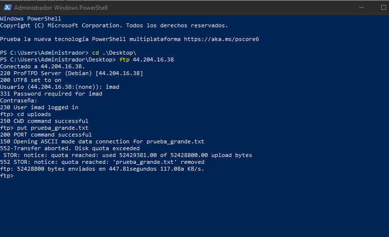
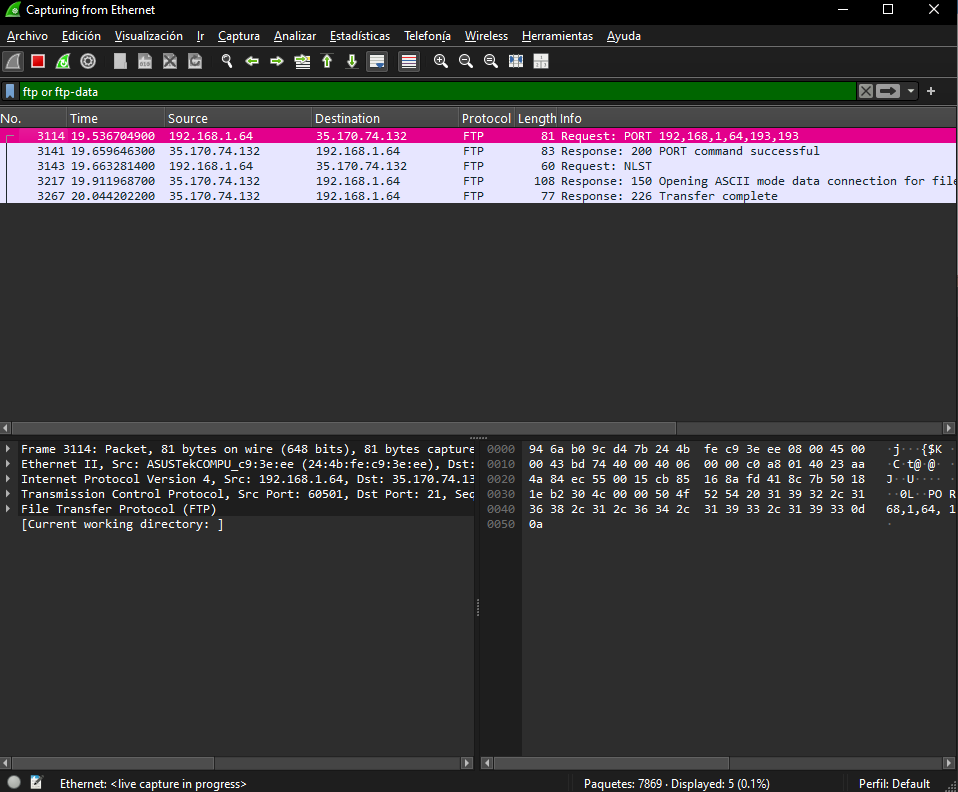
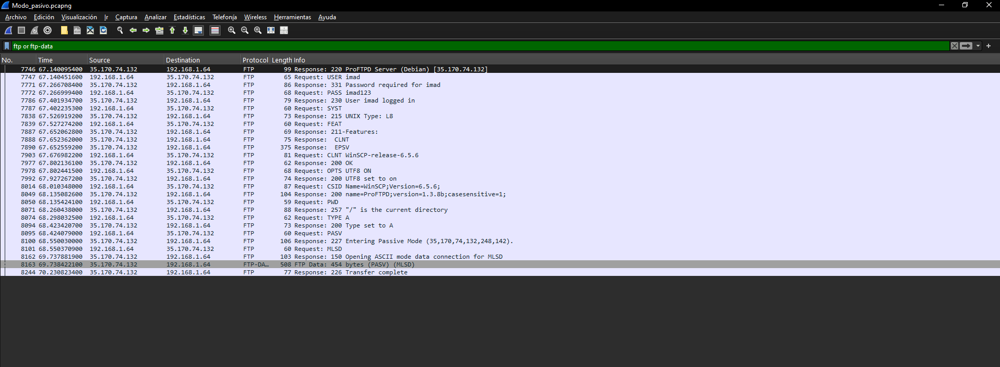
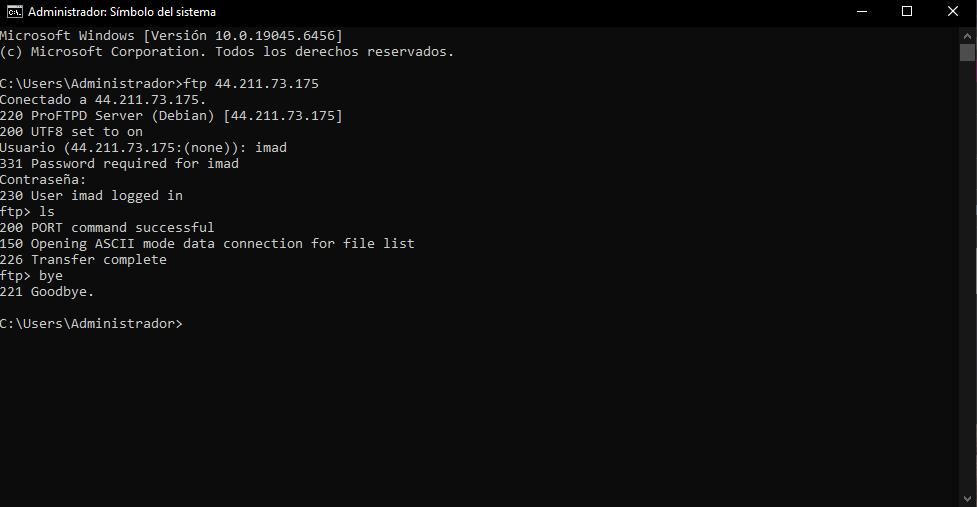
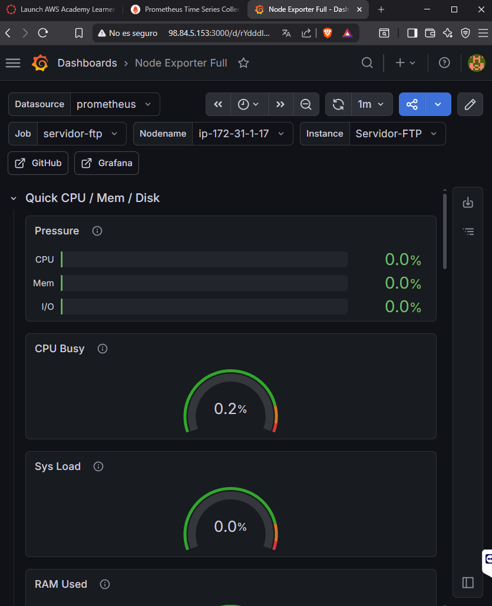

# Proyecto FTP en AWS

## ¿Qué es esto?

Este proyecto consiste en montar un servidor FTP en la nube de AWS con autenticación de usuarios mediante LDAP. Todo está automatizado con Terraform, así que con un solo comando se levanta toda la infraestructura sin tener que configurar nada a mano. La idea era aprender cómo funciona un servidor FTP real en producción y cómo se integra con un directorio de usuarios.

---

## ¿Por qué FTP?

El FTP lleva décadas siendo el protocolo estándar para transferir archivos entre máquinas. Lo usamos porque nos permite tener usuarios con distintos permisos, acceso anónimo y cuotas de disco. ¿Podríamos usar otra cosa? Sí, hoy en día hay alternativas como SFTP o directamente S3, pero para este proyecto FTP nos viene bien porque podemos integrarlo con LDAP y ver cómo funciona la autenticación centralizada.

Lo bueno es que es compatible con casi cualquier cliente y se integra bien con LDAP. Lo malo es que las contraseñas viajan en texto plano si no usas FTPS, los navegadores modernos ya no lo soportan y hay que abrir un rango grande de puertos para el modo pasivo.

---

## ¿Por qué ProFTPD y no otro?

He elegido ProFTPD porque es el que mejor se integra con LDAP gracias a su módulo `mod_ldap`. Además para instalarlo necesitaba Ubuntu, ya que en Amazon Linux no está disponible en los repositorios oficiales. El servidor LDAP en cambio sí va en Amazon Linux 2023 porque OpenLDAP sí está disponible ahí.

---

## Cómo está montado

La infraestructura tiene dos VPCs separadas. En la VPC pública están el servidor FTP y el servidor de monitorización, y en la VPC privada está el servidor LDAP sin IP pública y sin acceso desde internet. Las dos VPCs están conectadas mediante VPC Peering para que el FTP pueda consultar al LDAP cuando alguien intenta conectarse.

El LDAP está en la VPC privada a propósito. No tiene ningún sentido que la base de datos de usuarios sea accesible desde internet.

```
VPC Pública (172.31.0.0/16)
├── Servidor FTP - Ubuntu - IP privada 172.31.1.17
└── Servidor Monitoring - Ubuntu

VPC Privada (10.1.0.0/16)
└── Servidor LDAP - Amazon Linux 2023 - IP privada 10.1.1.50
```

---

## Cómo lanzarlo

He conectado mis credenciales de aws a terraform y descargado el par de claves `imad-key`para poder entrar por SSH y verificar que todo estaba funcionando 


```bash

# Lanzar toda la infraestructura
terraform init
terraform apply -auto-approve
```

Cuando termina te da las IPs públicas del FTP y del servidor de monitorización con el archivo `outputs.tf`. Y para destruirlo todo:

```bash
terraform destroy -auto-approve
```

---

## El servidor LDAP

OpenLDAP guarda los usuarios que luego usa ProFTPD para autenticar. Está en la VPC privada y solo el servidor FTP puede hablar con él a través del peering.

Lo más importante que aprendí aquí es que en Amazon Linux 2023, slapd no tiene un fichero de configuración normal. Todo se configura desde dentro con `ldapmodify`. Y además hay que hacerlo en tres operaciones separadas porque si intentas cambiar el dominio, el administrador y la contraseña en un solo archivo falla con este error:

```
ldapmodify: wrong attributeType at line 5
```

Los usuarios creados son senen con contraseña senen123 e imad con contraseña imad123.

---

## El servidor FTP

ProFTPD se configura con el script `FTP.sh` que se ejecuta automáticamente cuando se lanza la instancia. Lo más complicado de todo el proyecto han sido precisamente los scripts `.sh`. Por cualquier cosa pequeña fallaban y la instancia se creaba vacía sin dar ningún error visible. Había que entrar a los logs del cloud-init para ver qué había pasado:

```bash
cat /var/log/cloud-init-output.log | tail -50
```

Los problemas que fui encontrando uno a uno fueron que el módulo LDAP de Ubuntu viene comentado en `modules.conf` y hay que activarlo, que el `proftpd.conf` original tiene `QuotaEngine off` que anulaba nuestra configuración de cuotas, y que la carpeta home del usuario tiene que ser de root para que funcione el chroot de ProFTPD. Para escribir, el usuario necesita una subcarpeta `uploads` dentro de su home.

---

## Usuarios y permisos

Los usuarios están en LDAP, no en el sistema operativo del servidor FTP. Cuando alguien se conecta por FTP, ProFTPD consulta al LDAP para verificar las credenciales.

Cada usuario tiene una cuota diferente. Imad puede subir hasta 50MB y senen hasta 100MB. Cuando imad intenta subir un archivo de 60MB el servidor lo corta:

*(Captura demostrativa de las cuotas en los clientes)*


---

## Acceso anónimo

Se puede entrar sin contraseña usando el usuario anonymous. Solo tiene permisos de lectura, está limitado a 10 conexiones simultáneas y su directorio es `/srv/ftp/publico`.

```
ftp> open IP_SERVIDOR
Usuario: anonymous
Contraseña: cualquier@email.com
```

---

## Modo activo vs modo pasivo

El FTP tiene dos formas de transferir datos y se diferencian en quién abre la conexión.

En modo activo el cliente le dice al servidor a qué puerto conectarse y el servidor inicia la conexión de datos. En Wireshark se ve así:

*(Captura demostrativa del comando en Wireshark)*


En modo pasivo el cliente le pregunta al servidor en qué puerto conectarse y es el cliente quien inicia la conexión. En Wireshark se ve así:

*(Captura demostrativa del comando en Wireshark)*


En AWS hay que usar modo pasivo porque el servidor está detrás de NAT. Por eso tenemos `MasqueradeAddress` con la IP pública, para que el servidor le diga al cliente su IP pública y no la privada de dentro de la VPC. El cliente CMD de Windows usa modo activo por defecto y FileZilla y WinSCP usan pasivo.

---

## Clientes FTP probados

He probado tres clientes distintos. FileZilla es el cliente gráfico más conocido y usa modo pasivo por defecto. WinSCP es otro cliente gráfico para Windows, hay que configurarlo en modo FTP porque por defecto usa SFTP. Y el CMD de Windows tiene un cliente FTP integrado que usa modo activo por defecto:

*(Captura demostrativa del FTP en la CMD)*


---

## Navegador como cliente FTP

Los navegadores modernos ya no soportan FTP. Chrome lo eliminó en 2021 y el resto lo fueron quitando también. Si pones `ftp://IP` en la barra de direcciones simplemente no hace nada. Tiene sentido porque FTP manda las contraseñas en texto plano, algo que los navegadores ya no permiten por seguridad.

---

## Monitorización con Prometheus y Grafana

Para monitorizar el servidor FTP usamos Prometheus y Grafana en una instancia separada. El servidor FTP tiene instalado Node Exporter que expone métricas del sistema en el puerto 9100. Prometheus recoge esas métricas cada 15 segundos y Grafana las muestra en gráficas.

El puerto 9100 solo está abierto para la VPC interna, no para internet.

Para verlo entra a `http://IP_MONITORING:3000` con usuario admin y contraseña admin, añade Prometheus como datasource con URL `http://localhost:9090` e importa el dashboard con ID 1860 que es el Node Exporter Full.

*(Captura demostrativa de Monitorizacion del servidor)*


---

## Lo que he aprendido

He conseguido desarrollar mis habilidades un poco mas y soltarme con las infraestructuras de la nube y a controlar un poco mejor terraform realizando un control de versiones.

También he aprendido que automatizar con scripts tiene mucha trampa. Un pequeño error en el orden de los comandos o en los permisos de una carpeta hace que todo falle. He tenido que aprender a leer los logs del cloud-init para entender qué estaba pasando dentro de la instancia durante el arranque, algo que no sabía que existía.

Y sobre LDAP, que estoy aprendiendo a usarlo, he entendido para qué sirve: centralizar los usuarios en un solo sitio para que varios servicios puedan autenticarse contra él. En lugar de crear el usuario en cada servidor lo creas una sola vez en LDAP y cualquier servicio configurado para usarlo puede autenticar.

---

